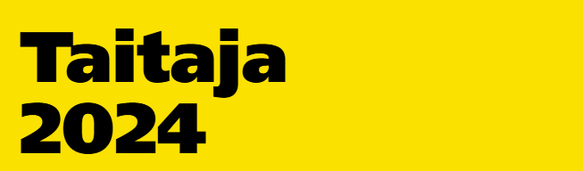

 

# Taitaja 2024 Web-kehitys kilpailutehtävät

## Semifinaali

Semifinaalitehtävässä kilpailijoiden tulee rakentaa **Tuottajamarket** -verkkopalvelu, jonka kautta tuottajat voivat myydä lähiruokaa kuluttajille kotiinkuljetuksella. 
Semifinaalitehtävästä on nähtävillä myös arviointi- eli pisteytystaulukko. 
## Finaali

Finaalitehtävässä kilpailijoiden on suunniteltava, luotava ja kehitettävä **Retro Game House** -yritykselle High Score Hall of Fame -kunniagalleria sivusto. 
Finaalitehtävistä on nähtävillä myös arviointi- eli pisteytystaulukko. 

Voit tutustua eri moduuleihin, jotka omissa kansioissaan.

Voit myös tutustua EuroSkills ja WorldSkills kilpailuissa menestyneen unkarilaisen Oliver Mrakovicsin esimerkkiratkaisuun finaalitehtävistä. Hän osallistui Taitajiin osana omaa WorldSkills 2024 Lyon valmennustaan. 
